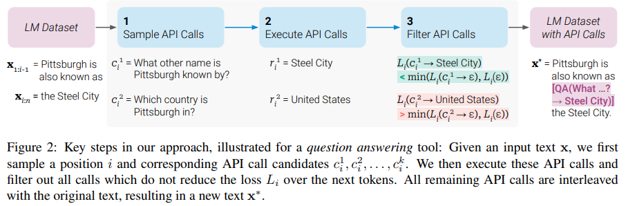

</img>

## Introduction

This is a Personal Pytorch implementation of Toolformer.
At present, only the procedural framework of the paper has been completed. The actual construction of the environment for operation will be carried out subsequently. Please stay tuned.

## Toolformer

Implementation of <a href="https://arxiv.org/abs/2302.04761">Toolformer</a>: Language Models That Can Use Tools, by MetaAI

## Usage

1. Sample API Calls
```bash
python ./data/main_sample.py
```

2. Execute API Calls
```bash
python ./data/exec_api.py
```

3. Filter API Calls
```bash
python ./data/filter_api.py
```

4. Finetuning Phase(Todo)
```bash
python ./model/train.py
```

5. Inference Phase(Todo)
```bash
python ./model/inference.py
```

## Citations

```bibtex
@inproceedings{Schick2023ToolformerLM,
    title   = {Toolformer: Language Models Can Teach Themselves to Use Tools},
    author  = {Timo Schick and Jane Dwivedi-Yu and Roberto Dessi and Roberta Raileanu and Maria Lomeli and Luke Zettlemoyer and Nicola Cancedda and Thomas Scialom},
    year    = {2023}
}
```